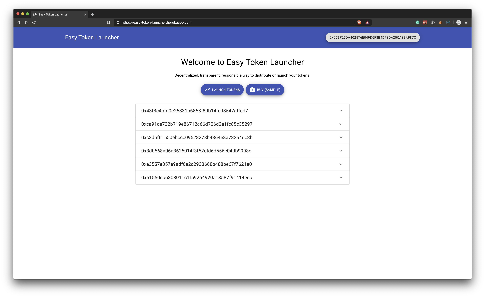

## Easy-Token-Launcher

Easy-Token-launcher aims to be a platform where orgs can launch and then distribute their tokens automatically. Rules for distribution are specified on a smart contract and then according to that rules the whole distribution takes place. This removes the non-transparency that current token launches faces and increases trust among token holders for that community.

A demo version is deployed on rinkeby here: https://easy-token-launcher.herokuapp.com/ 

### Problems with current model of ICO

ICOS are losing their luster, leading many to question whether token sales for decentralized networks have a future at all. 80% of the ICOs were reported as scams last year causing reputation damage to this model and also to the network on which they were using.

SEC recently announced their new [framework](https://www.sec.gov/corpfin/framework-investment-contract-analysis-digital-assets) on digital asset sales and that looks very promising. Now, a decentralized, transparent and responsible way is immediately required so that organisations can distribute their tokens.


### How it works
Our platform is powered by Airswap. Airswap is a peer to peer, decentralized network where users can exchange tokens among themselves without involving any intermediary. Airswap provides a `PeerFactory` contract which parties can use to create their `PeerContract`. One peer contract can distribute multiple tokens. 

_Note: `PeerFactory` and `Swap` contracts are already deployed on rinkeby so we have hardcoded their values in our code._

**Launch Token**

When you click launch, our app wil check whether you have already deployed a peer or not. If not then it'll deploy a `Peer` first through `PeerFactory`'s `createPeer` method and then set rules (using Peer's `setRule` method) which will specify that
- Maximum how many tokens can be distributed by your deployed peer.
- Which token your peer will accept as a mode of payyment and how many tokens will you receive for that.


**View Launches**

Whenever a user logins, he can see all the exisiting launches in the market. He can see their owner, price, tokens offered etc. We fetch peers from `PeerFactory`'s subgraph and then show all available peers along with owner on the home page.



**Buy/Sell Token**

A user after choosing a token launch can either buy that token for another token (accepted by that Peer) or sell that token for corresponding token. We use airswap's apis such as `getMakerSideQuote`, `getTakerSideQuote` and `getMaxQuote` to get conversion rates for the tokens and also the maximum amount which a user can buy/sell. Finally we create a order based on user's parameters and call `provideOrder` to trigger the swap.


### Setting up development environment

#### Prerequisites
- `yarn`
- `node` and `npm`
- MetaMask

#### Steps
```sh
$ cd easy-token-launcher
$ yarn
$ yarn start
```

### How it can be improved
- We could use a registry contract and data source templates. Then, whenever a contract is added to the registry contract and an event(`PeerCreated`) is emitted from it, you could create a dynamic data source from a template.
- We have currently developed this app as a pure frontend application which uses js in browser to call contract methods. We should give the ability to users to add metadata like token information, launcher community website etc so that users can have better experience and learn about a token as much as possible. Using a backend or decentralized database to store metadata would help in this regard.